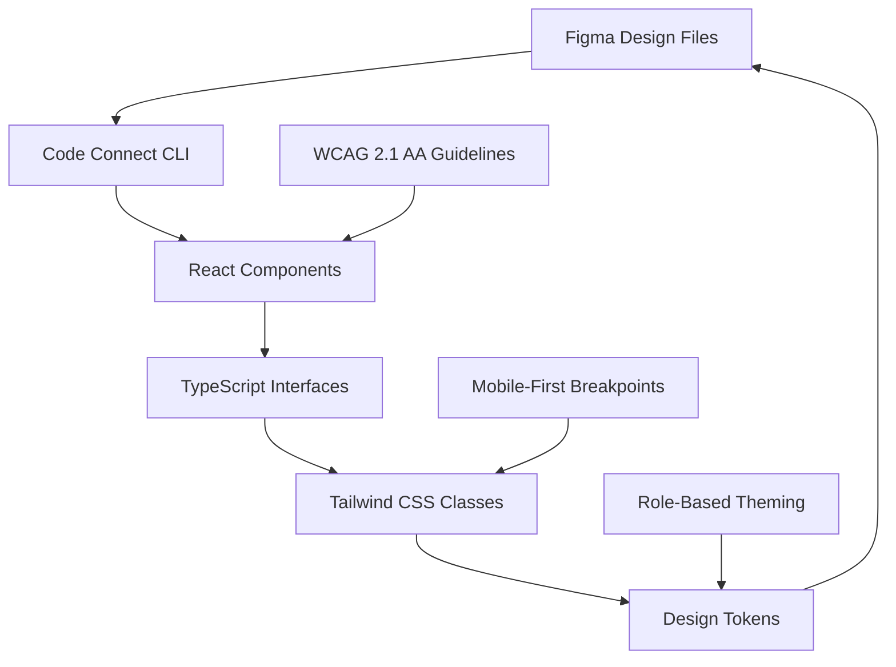

# Design Document: Frontend UI Redesign

## Overview

This design outlines a comprehensive frontend UI redesign for the multilingual mandi platform, focusing on improved user experience, accessibility, and Figma integration. The redesign will transform the existing React application into a more intuitive, accessible, and maintainable system that serves users with varying technical literacy levels across different roles.

The design leverages the existing technology stack (React 19.2.0, TypeScript, Tailwind CSS 3.4.17, Vite) while introducing a robust design system connected to Figma through Code Connect. The approach prioritizes mobile-first responsive design, WCAG 2.1 AA accessibility compliance, and role-based user experiences.

Key design principles include:
- **Accessibility First**: WCAG 2.1 AA compliance with inclusive design patterns
- **Mobile-First**: Optimized for smartphone users in mandi environments
- **Role-Based UX**: Tailored interfaces for vendors, buyers, agents, and admins
- **Design System Consistency**: Unified visual language through Figma integration
- **Progressive Enhancement**: Graceful degradation for varying network conditions

## Architecture

### Design System Architecture

The design system follows a token-based architecture with three layers:

1. **Design Tokens Layer**: Foundational values (colors, typography, spacing) defined in both Figma and Tailwind CSS
2. **Component Layer**: Reusable UI components with TypeScript interfaces and Figma mappings
3. **Pattern Layer**: Composed layouts and user flows for specific use cases



### Component Architecture

The component architecture follows atomic design principles with enhanced accessibility and mobile optimization:

- **Atoms**: Basic UI elements (buttons, inputs, icons) with accessibility attributes
- **Molecules**: Combined atoms (search bars, navigation items) with interaction patterns  
- **Organisms**: Complex components (headers, forms, data tables) with responsive behavior
- **Templates**: Page layouts with role-specific variations
- **Pages**: Complete user interfaces with data integration

### Integration Architecture

The Figma integration uses Code Connect to maintain design-code synchronization:

```typescript
// Example Code Connect mapping
figma.connect(Button, 'figma-component-url', {
  props: {
    variant: figma.enum('Variant', {
      'Primary': 'primary',
      'Secondary': 'secondary',
      'Danger': 'danger'
    }),
    size: figma.enum('Size', {
      'Small': 'sm',
      'Medium': 'md', 
      'Large': 'lg'
    }),
    disabled: figma.boolean('Disabled'),
    label: figma.string('Label')
  },
  example: ({ variant, size, disabled, label }) => (
    <Button variant={variant} size={size} disabled={disabled}>
      {label}
    </Button>
  )
})
```

## Components and Interfaces

### Core Design System Components

#### 1. Typography System
```typescript
interface TypographyProps {
  variant: 'h1' | 'h2' | 'h3' | 'h4' | 'body' | 'caption' | 'label'
  weight?: 'normal' | 'medium' | 'semibold' | 'bold'
  color?: 'primary' | 'secondary' | 'muted' | 'error' | 'success'
  align?: 'left' | 'center' | 'right'
  className?: string
  children: React.ReactNode
}

// Tailwind classes mapped to design tokens
const typographyClasses = {
  h1: 'text-3xl md:text-4xl font-bold font-display',
  h2: 'text-2xl md:text-3xl font-semibold font-display', 
  h3: 'text-xl md:text-2xl font-semibold font-sans',
  h4: 'text-lg md:text-xl font-medium font-sans',
  body: 'text-base font-normal font-sans',
  caption: 'text-sm font-normal font-sans',
  label: 'text-sm font-medium font-sans'
}
```

#### 2. Button System
```typescript
interface ButtonProps {
  variant: 'primary' | 'secondary' | 'outline' | 'ghost' | 'danger'
  size: 'sm' | 'md' | 'lg'
  role?: 'vendor' | 'buyer' | 'agent' | 'admin'
  disabled?: boolean
  loading?: boolean
  icon?: React.ReactNode
  iconPosition?: 'left' | 'right'
  fullWidth?: boolean
  onClick?: () => void
  'aria-label'?: string
  children: React.ReactNode
}

// Role-based color mapping
const roleColors = {
  vendor: 'bg-green-600 hover:bg-green-700 focus:ring-green-500',
  buyer: 'bg-blue-600 hover:bg-blue-700 focus:ring-blue-500',
  agent: 'bg-purple-600 hover:bg-purple-700 focus:ring-purple-500',
  admin: 'bg-gray-600 hover:bg-gray-700 focus:ring-gray-500'
}
```

#### 3. Form Components
```typescript
interface InputProps {
  type: 'text' | 'email' | 'password' | 'number' | 'tel'
  label: string
  placeholder?: string
  value: string
  onChange: (value: string) => void
  error?: string
  required?: boolean
  disabled?: boolean
  'aria-describedby'?: string
  'aria-invalid'?: boolean
}

interface SelectProps {
  label: string
  options: Array<{ value: string; label: string }>
  value: string
  onChange: (value: string) => void
  error?: string
  required?: boolean
  disabled?: boolean
  'aria-describedby'?: string
}
```

### Page-Specific Components

#### 1. Landing Page Components
```typescript
interface HeroSectionProps {
  title: string
  subtitle: string
  ctaButtons: Array<{
    label: string
    variant: 'primary' | 'secondary'
    role: 'vendor' | 'buyer' | 'agent'
    onClick: () => void
  }>
  backgroundImage?: string
}

interface FeatureCardProps {
  icon: React.ReactNode
  title: string
  description: string
  role?: 'vendor' | 'buyer' | 'agent'
}

interface TrustIndicatorsProps {
  userCount: number
  transactionCount: number
  languages: number
  testimonials: Array<{
    name: string
    role: string
    content: string
    rating: number
  }>
}
```

#### 2. Dashboard Components
```typescript
interface DashboardLayoutProps {
  userRole: 'vendor' | 'buyer' | 'agent' | 'admin'
  user: User
  navigation: NavigationItem[]
  children: React.ReactNode
}

interface MetricCardProps {
  title: string
  value: string | number
  change?: {
    value: number
    type: 'increase' | 'decrease'
    period: string
  }
  icon: React.ReactNode
  color: 'green' | 'blue' | 'purple' | 'red' | 'gray'
}

interface QuickActionProps {
  title: string
  description: string
  icon: React.ReactNode
  onClick: () => void
  disabled?: boolean
}
```

#### 3. Price Discovery Components
```typescript
interface PriceChartProps {
  data: PriceDataPoint[]
  commodity: string
  region: string
  timeframe: '1d' | '1w' | '1m' | '3m' | '1y'
  onTimeframeChange: (timeframe: string) => void
}

interface PriceAlertProps {
  commodity: string
  currentPrice: number
  targetPrice: number
  alertType: 'above' | 'below'
  isActive: boolean
  onToggle: () => void
}

interface MarketSummaryProps {
  topGainers: CommodityPrice[]
  topLosers: CommodityPrice[]
  mostTraded: CommodityPrice[]
}
```

### Accessibility Components

#### 1. Screen Reader Support
```typescript
interface ScreenReaderOnlyProps {
  children: React.ReactNode
}

interface SkipLinkProps {
  href: string
  children: React.ReactNode
}

interface LiveRegionProps {
  politeness: 'polite' | 'assertive'
  children: React.ReactNode
}
```

#### 2. Focus Management
```typescript
interface FocusTrapProps {
  active: boolean
  children: React.ReactNode
}

interface FocusIndicatorProps {
  visible: boolean
  className?: string
}
```

## Data Models

### Design System Models

```typescript
interface DesignToken {
  name: string
  value: string | number
  type: 'color' | 'spacing' | 'typography' | 'shadow' | 'border'
  category: string
  description?: string
}

interface ComponentVariant {
  name: string
  props: Record<string, any>
  figmaNodeId?: string
  codeExample: string
}

interface ComponentDefinition {
  name: string
  description: string
  category: 'atom' | 'molecule' | 'organism' | 'template'
  variants: ComponentVariant[]
  props: TypeScriptInterface
  accessibility: AccessibilityRequirements
  figmaFileId?: string
}
```

### User Interface Models

```typescript
interface UITheme {
  name: string
  colors: {
    primary: string
    secondary: string
    background: string
    surface: string
    text: string
    textSecondary: string
    border: string
    error: string
    warning: string
    success: string
    info: string
  }
  typography: {
    fontFamily: string
    fontSizes: Record<string, string>
    fontWeights: Record<string, number>
    lineHeights: Record<string, number>
  }
  spacing: Record<string, string>
  breakpoints: Record<string, string>
}

interface ResponsiveBreakpoint {
  name: 'xs' | 'sm' | 'md' | 'lg' | 'xl' | '2xl'
  minWidth: number
  maxWidth?: number
  columns: number
  gutters: number
}

interface AccessibilitySettings {
  highContrast: boolean
  reducedMotion: boolean
  fontSize: 'small' | 'medium' | 'large' | 'extra-large'
  screenReaderOptimized: boolean
}
```

### Page Layout Models

```typescript
interface PageLayout {
  id: string
  name: string
  description: string
  userRoles: UserRole[]
  sections: LayoutSection[]
  navigation: NavigationConfig
  responsive: ResponsiveConfig
}

interface LayoutSection {
  id: string
  name: string
  component: string
  props: Record<string, any>
  gridArea?: string
  responsive: {
    [breakpoint: string]: {
      display: boolean
      order?: number
      span?: number
    }
  }
}

interface NavigationConfig {
  type: 'sidebar' | 'header' | 'bottom' | 'drawer'
  items: NavigationItem[]
  responsive: {
    mobile: 'drawer' | 'bottom' | 'hidden'
    tablet: 'sidebar' | 'header' | 'drawer'
    desktop: 'sidebar' | 'header'
  }
}
```

### Form and Input Models

```typescript
interface FormField {
  id: string
  type: 'text' | 'email' | 'password' | 'number' | 'select' | 'checkbox' | 'radio' | 'textarea'
  label: string
  placeholder?: string
  required: boolean
  validation: ValidationRule[]
  accessibility: {
    ariaLabel?: string
    ariaDescribedby?: string
    helpText?: string
  }
}

interface ValidationRule {
  type: 'required' | 'email' | 'minLength' | 'maxLength' | 'pattern' | 'custom'
  value?: any
  message: string
}

interface FormLayout {
  id: string
  name: string
  fields: FormField[]
  sections?: FormSection[]
  submitButton: ButtonConfig
  responsive: boolean
}
```

### Figma Integration Models

```typescript
interface FigmaComponent {
  id: string
  name: string
  description?: string
  figmaNodeId: string
  figmaFileId: string
  componentPath: string
  props: ComponentProp[]
  variants: ComponentVariant[]
  lastSynced: Date
}

interface ComponentProp {
  name: string
  type: 'string' | 'boolean' | 'enum' | 'number'
  required: boolean
  defaultValue?: any
  figmaProperty?: string
  description?: string
}

interface DesignSystemSync {
  lastSync: Date
  components: FigmaComponent[]
  tokens: DesignToken[]
  conflicts: SyncConflict[]
  status: 'synced' | 'pending' | 'error'
}

interface SyncConflict {
  type: 'component' | 'token' | 'prop'
  componentId?: string
  tokenName?: string
  figmaValue: any
  codeValue: any
  resolution: 'figma' | 'code' | 'manual'
}
```

## Correctness Properties

*A property is a characteristic or behavior that should hold true across all valid executions of a system—essentially, a formal statement about what the system should do. Properties serve as the bridge between human-readable specifications and machine-verifiable correctness guarantees.*

Based on the prework analysis, the following properties validate the correctness of the frontend UI redesign:

### Property 1: Design System Completeness
*For any* design system configuration, all required design tokens (colors, typography, spacing, components) should be present with valid values and proper TypeScript interfaces
**Validates: Requirements 1.1, 1.3, 1.5**

### Property 2: Design Token Synchronization  
*For any* design token update in Figma, the corresponding React component styles should reflect the changes after synchronization
**Validates: Requirements 1.2, 11.4**

### Property 3: Role-Based Theming Consistency
*For any* user role (vendor, buyer, agent, admin), all UI components should apply the correct theme colors and styling consistently throughout the interface
**Validates: Requirements 1.4, 9.6**

### Property 4: WCAG Accessibility Compliance
*For any* interactive element, it should meet WCAG 2.1 AA standards including proper color contrast ratios, ARIA labels, keyboard navigation, and screen reader support
**Validates: Requirements 2.1, 2.2, 2.3, 2.4, 2.5**

### Property 5: Text Scaling Preservation
*For any* UI component, when text is scaled up to 200%, all functionality should remain accessible without loss of features or content overlap
**Validates: Requirements 2.6**

### Property 6: Mobile-First Responsive Behavior
*For any* viewport width from 320px to 1920px, the interface should provide optimal layout without horizontal scrolling and with touch-friendly interactions (minimum 44px targets)
**Validates: Requirements 3.1, 3.2, 3.3, 3.4**

### Property 7: Progressive Enhancement Performance
*For any* network condition, the interface should load critical content first with appropriate loading indicators and graceful degradation for poor connectivity
**Validates: Requirements 3.5, 12.1, 12.2, 12.5**

### Property 8: Role-Specific Dashboard Content
*For any* user role, the dashboard should display role-appropriate widgets and prioritize relevant features (inventory for vendors, search for buyers, transactions for agents, analytics for admins)
**Validates: Requirements 5.1, 5.2, 5.3, 5.4, 5.5**

### Property 9: Authentication Flow Completeness
*For any* authentication action (login, register, password recovery), the interface should provide clear forms, validation, error messaging, and multi-language support with proper text direction
**Validates: Requirements 4.2, 4.3, 4.4, 4.5**

### Property 10: Widget Customization Persistence
*For any* dashboard widget arrangement, user customizations should persist across sessions and maintain functionality
**Validates: Requirements 5.6**

### Property 11: Real-Time Data Display
*For any* real-time data update (prices, messages, notifications), the interface should provide smooth visual feedback with appropriate animations and status indicators
**Validates: Requirements 6.1, 6.2, 7.3, 8.1**

### Property 12: Data Filtering and Search
*For any* filterable dataset (prices, transactions, messages), users should be able to filter and sort by relevant criteria with immediate visual feedback
**Validates: Requirements 6.3, 8.6, 10.1**

### Property 13: Touch Interaction Optimization
*For any* interactive chart or data visualization, touch controls should be responsive and appropriately sized for mobile interaction
**Validates: Requirements 6.4**

### Property 14: Translation Content Distinction
*For any* translated content, original and translated text should be visually distinguishable with clear indicators
**Validates: Requirements 7.6**

### Property 15: File Upload Progress Tracking
*For any* file upload operation, users should see clear progress indicators and file type validation
**Validates: Requirements 7.5**

### Property 16: Transaction Workflow Guidance
*For any* multi-step process (deal creation, negotiation, dispute resolution), users should see clear progress indicators and validation at each step
**Validates: Requirements 8.2, 8.5, 7.4**

### Property 17: Security Indicator Display
*For any* secure operation (payments, sensitive data), appropriate security indicators should be prominently displayed
**Validates: Requirements 8.4**

### Property 18: Trust System Transparency
*For any* trust-related display (reputation scores, reviews, verification status), information should be presented clearly with explanations for changes
**Validates: Requirements 9.1, 9.2, 9.5**

### Property 19: Settings Change Confirmation
*For any* critical setting modification, the system should require confirmation and provide undo options where appropriate
**Validates: Requirements 10.2, 10.5**

### Property 20: Figma Component Mapping
*For any* React component connected to Figma, property mappings should remain synchronized and Code Connect should provide accurate code examples
**Validates: Requirements 11.1, 11.3, 11.6**

### Property 21: Design Change Notification
*For any* design update in Figma, the system should detect changes and provide clear migration paths for developers
**Validates: Requirements 11.2**

### Property 22: Lazy Loading Implementation
*For any* non-critical content or images, loading should be deferred until needed with appropriate placeholder states
**Validates: Requirements 12.6**

### Property 23: Offline Functionality Indication
*For any* network state change, users should receive clear feedback about offline capabilities and feature availability
**Validates: Requirements 12.3**

### Property 24: Asset Optimization Adaptation
*For any* image or asset, delivery should be optimized for the user's screen density and network conditions
**Validates: Requirements 12.4**

## Error Handling

### Client-Side Error Boundaries

The application implements comprehensive error boundaries to gracefully handle component failures:

```typescript
interface ErrorBoundaryState {
  hasError: boolean
  error?: Error
  errorInfo?: ErrorInfo
}

class UIErrorBoundary extends Component<Props, ErrorBoundaryState> {
  // Catches JavaScript errors in component tree
  // Displays fallback UI with recovery options
  // Logs errors for monitoring and debugging
}
```

### Accessibility Error Prevention

- **Form Validation**: Real-time validation with clear error messages
- **Focus Management**: Automatic focus on error fields with screen reader announcements
- **Color Independence**: Error states use icons and text, not just color
- **Timeout Handling**: Extended timeouts for users with disabilities

### Network Error Handling

```typescript
interface NetworkErrorState {
  isOnline: boolean
  lastSync: Date
  pendingActions: Action[]
  errorMessage?: string
}

// Progressive degradation for poor connectivity
// Offline queue for critical actions
// Clear user feedback about network status
// Retry mechanisms with exponential backoff
```

### Design System Error States

- **Component Fallbacks**: Default states when props are invalid
- **Token Validation**: Runtime validation of design tokens
- **Figma Sync Errors**: Clear error reporting for sync failures
- **Missing Assets**: Graceful handling of missing images or icons

### User Input Error Handling

```typescript
interface ValidationError {
  field: string
  message: string
  type: 'required' | 'format' | 'length' | 'custom'
}

// Multi-language error messages
// Contextual help for complex fields
// Progressive disclosure of validation rules
// Accessibility-compliant error announcements
```

## Testing Strategy

### Dual Testing Approach

The testing strategy employs both unit tests and property-based tests to ensure comprehensive coverage:

**Unit Tests**: Focus on specific examples, edge cases, and integration points
- Component rendering with various prop combinations
- User interaction flows (click, keyboard navigation, form submission)
- Error boundary behavior and recovery
- Accessibility compliance for specific scenarios
- Integration between Figma sync and component updates

**Property-Based Tests**: Verify universal properties across all inputs using fast-check
- Design token validation across random configurations
- Responsive behavior across random viewport sizes
- Accessibility compliance across random component states
- Role-based theming across random user configurations
- Form validation across random input combinations

### Property-Based Testing Configuration

**Library**: fast-check 4.5.3 (already installed in the project)
**Test Runner**: Vitest 4.0.18 with jsdom environment
**Minimum Iterations**: 100 per property test (due to randomization)

Each property test references its corresponding design document property:
```typescript
// Example property test structure
test('Property 6: Mobile-First Responsive Behavior', () => {
  fc.assert(fc.property(
    fc.integer(320, 1920), // viewport width
    fc.record({...}), // component props
    (width, props) => {
      // Test responsive behavior
      // **Feature: frontend-ui-redesign, Property 6: Mobile-First Responsive Behavior**
    }
  ), { numRuns: 100 })
})
```

### Testing Categories

#### 1. Design System Tests
- **Unit Tests**: Component prop validation, theme application, token parsing
- **Property Tests**: Token completeness, theme consistency, component interface compliance

#### 2. Accessibility Tests  
- **Unit Tests**: Specific WCAG compliance scenarios, keyboard navigation paths
- **Property Tests**: Universal accessibility compliance across component states

#### 3. Responsive Design Tests
- **Unit Tests**: Specific breakpoint behavior, touch target validation
- **Property Tests**: Layout adaptation across viewport ranges, touch interaction compliance

#### 4. Integration Tests
- **Unit Tests**: Figma sync workflows, authentication flows, data loading sequences
- **Property Tests**: End-to-end user workflows across different configurations

#### 5. Performance Tests
- **Unit Tests**: Loading state behavior, lazy loading triggers, offline functionality
- **Property Tests**: Performance characteristics across network conditions and data sizes

### Test Environment Setup

```typescript
// Test setup configuration
import { setupServer } from 'msw/node'
import { render } from '@testing-library/react'
import { vi } from 'vitest'
import fc from 'fast-check'

// Mock Figma API for integration tests
// Mock network conditions for performance tests  
// Mock accessibility APIs for a11y tests
// Provide test data generators for property tests
```

The testing strategy ensures that both concrete scenarios (unit tests) and universal behaviors (property tests) are validated, providing comprehensive coverage for the frontend UI redesign while maintaining the existing project structure and tooling.