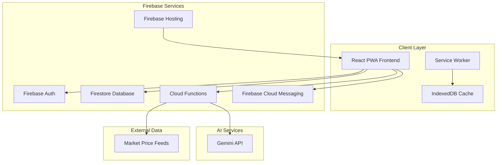
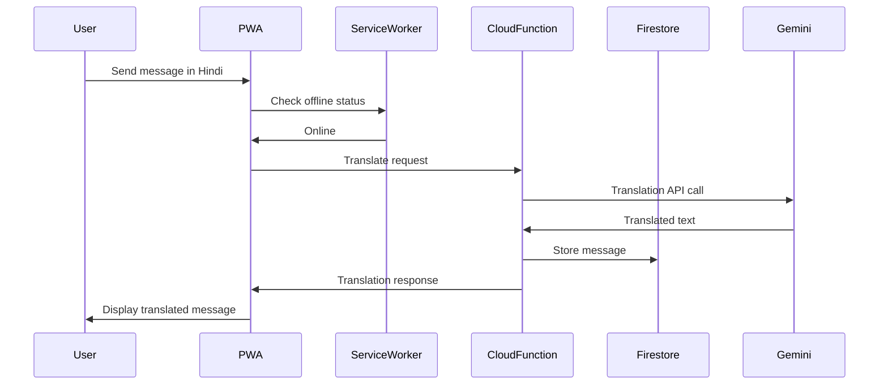
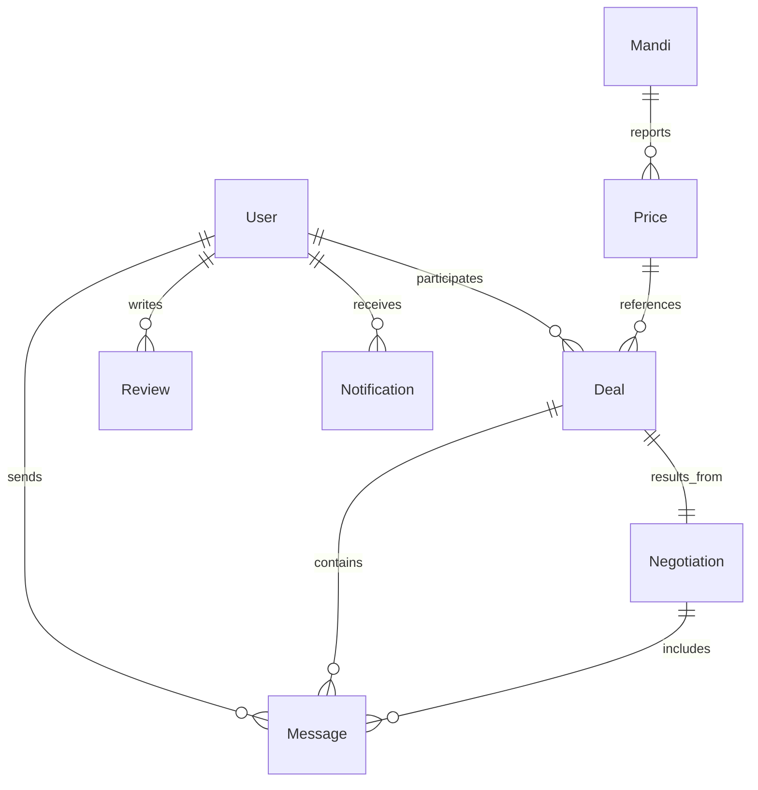

# Design Document

## Overview

The Multilingual Mandi Platform is a Progressive Web App (PWA) built on a modern React frontend with Firebase backend services and Gemini AI integration. The system follows an offline-first architecture with real-time synchronization, enabling seamless trading experiences across India's diverse linguistic and connectivity landscape.

The platform implements a microservices-style architecture where each major feature (authentication, translation, price discovery, negotiation, deals, trust) operates as a distinct service layer with well-defined interfaces. This modular approach ensures scalability, maintainability, and the ability to iterate on individual features without affecting the entire system.

## Architecture

### High-Level Architecture



### Service Architecture

The system is organized into distinct service layers:

1. **Authentication Service**: Manages user identity, roles, and session management
2. **Translation Service**: Handles multilingual communication via Gemini API
3. **Price Discovery Service**: Aggregates and analyzes market price data
4. **Negotiation Service**: Facilitates AI-assisted negotiations between users
5. **Deal Management Service**: Handles transaction lifecycle and payments
6. **Trust Service**: Manages user reputation and verification
7. **Notification Service**: Delivers alerts and updates via multiple channels
8. **Offline Sync Service**: Manages local data persistence and synchronization

### Data Flow Architecture



## Components and Interfaces

### Core Components

#### Authentication Component
```typescript
interface AuthService {
  signIn(email: string, password: string): Promise<AuthResult>
  signUp(email: string, password: string, role: UserRole): Promise<AuthResult>
  resetPassword(email: string): Promise<void>
  signOut(): Promise<void>
  getCurrentUser(): User | null
  onAuthStateChanged(callback: (user: User | null) => void): Unsubscribe
}

interface User {
  uid: string
  email: string
  role: UserRole
  language: Language
  location: Location
  onboardingCompleted: boolean
  verificationStatus: VerificationStatus
}
```

#### Translation Component
```typescript
interface TranslationService {
  translateText(text: string, fromLang: Language, toLang: Language): Promise<TranslationResult>
  translateVoice(audioBlob: Blob, fromLang: Language, toLang: Language): Promise<TranslationResult>
  getCachedTranslation(text: string, fromLang: Language, toLang: Language): TranslationResult | null
  getConfidenceScore(translation: TranslationResult): number
}

interface TranslationResult {
  originalText: string
  translatedText: string
  confidence: number
  fromLanguage: Language
  toLanguage: Language
  timestamp: Date
}
```

#### Price Discovery Component
```typescript
interface PriceDiscoveryService {
  getCurrentPrices(commodity: string, location?: Location): Promise<PriceData[]>
  getHistoricalPrices(commodity: string, dateRange: DateRange): Promise<PriceHistory>
  getPriceTrends(commodity: string): Promise<PriceTrend>
  detectPriceAnomalies(prices: PriceData[]): PriceAnomaly[]
  subscribeToPriceUpdates(commodity: string, callback: (price: PriceData) => void): Unsubscribe
}

interface PriceData {
  commodity: string
  mandi: string
  price: number
  unit: string
  quality: QualityGrade
  timestamp: Date
  source: string
}
```

#### Negotiation Component
```typescript
interface NegotiationService {
  startNegotiation(deal: DealProposal): Promise<Negotiation>
  sendMessage(negotiationId: string, message: Message): Promise<void>
  getSuggestedCounterOffer(negotiation: Negotiation, currentOffer: number): Promise<NegotiationSuggestion>
  getMarketComparison(commodity: string, price: number): Promise<MarketComparison>
  finalizeAgreement(negotiationId: string, terms: DealTerms): Promise<Deal>
}

interface NegotiationSuggestion {
  suggestedPrice: number
  reasoning: string
  marketData: MarketComparison
  confidence: number
}
```

#### Deal Management Component
```typescript
interface DealManagementService {
  createDeal(terms: DealTerms): Promise<Deal>
  updateDealStatus(dealId: string, status: DealStatus): Promise<void>
  initializePayment(dealId: string, paymentMethod: PaymentMethod): Promise<PaymentResult>
  trackDelivery(dealId: string): Promise<DeliveryStatus>
  raiseDispute(dealId: string, reason: string): Promise<Dispute>}

interface Deal {
  id: string
  buyerId: string
  sellerId: string
  commodity: string
  quantity: number
  agreedPrice: number
  deliveryTerms: DeliveryTerms
  status: DealStatus
  createdAt: Date
  updatedAt: Date
}
```

#### Trust System Component
```typescript
interface TrustService {
  getUserProfile(userId: string): Promise<UserProfile>
  updateTrustScore(userId: string, transaction: Transaction): Promise<void>
  verifyUser(userId: string, documents: VerificationDocument[]): Promise<VerificationResult>
  reportUser(reporterId: string, reportedId: string, reason: string): Promise<void>
  getTrustIndicators(userId: string): Promise<TrustIndicators>
}

interface TrustIndicators {
  overallScore: number
  transactionCount: number
  averageRating: number
  verificationBadges: VerificationBadge[]
  recentFeedback: Feedback[]
}
```

### Interface Contracts

#### Offline Sync Interface
```typescript
interface OfflineSyncService {
  cacheData(key: string, data: any, ttl?: number): Promise<void>
  getCachedData<T>(key: string): Promise<T | null>
  queueAction(action: OfflineAction): Promise<void>
  syncPendingActions(): Promise<SyncResult[]>
  getLastSyncTime(): Date | null
  isOnline(): boolean
}

interface OfflineAction {
  id: string
  type: ActionType
  payload: any
  timestamp: Date
  retryCount: number
}
```

#### Notification Interface
```typescript
interface NotificationService {
  sendPriceAlert(userId: string, priceAlert: PriceAlert): Promise<void>
  sendDealUpdate(userId: string, dealUpdate: DealUpdate): Promise<void>
  subscribeToNotifications(userId: string, preferences: NotificationPreferences): Promise<void>
  getNotificationHistory(userId: string): Promise<Notification[]>
  markAsRead(notificationId: string): Promise<void>
}
```

## Data Models

### Core Data Structures

#### User Data Model
```typescript
interface UserProfile {
  uid: string
  email: string
  role: 'vendor' | 'buyer' | 'agent'
  personalInfo: {
    name: string
    phone: string
    language: Language
    location: Location
  }
  businessInfo: {
    businessName?: string
    commodities: string[]
    operatingRegions: Location[]
  }
  preferences: {
    notifications: NotificationPreferences
    privacy: PrivacySettings
  }
  trustData: {
    verificationStatus: VerificationStatus
    trustScore: number
    transactionHistory: TransactionSummary[]
  }
  createdAt: Date
  updatedAt: Date
}
```

#### Transaction Data Model
```typescript
interface Transaction {
  id: string
  type: 'deal' | 'negotiation' | 'payment'
  participants: {
    buyer: string
    seller: string
    agent?: string
  }
  commodity: {
    name: string
    category: string
    quality: QualityGrade
    quantity: number
    unit: string
  }
  pricing: {
    initialOffer: number
    finalPrice: number
    marketPrice: number
    pricePerUnit: number
  }
  timeline: {
    initiated: Date
    negotiated?: Date
    agreed?: Date
    paid?: Date
    delivered?: Date
    completed?: Date
  }
  status: TransactionStatus
  metadata: {
    location: Location
    paymentMethod?: PaymentMethod
    deliveryTerms?: DeliveryTerms
  }
}
```

#### Message Data Model
```typescript
interface Message {
  id: string
  conversationId: string
  senderId: string
  receiverId: string
  content: {
    originalText: string
    originalLanguage: Language
    translations: Map<Language, string>
    messageType: 'text' | 'voice' | 'image' | 'document'
  }
  metadata: {
    timestamp: Date
    readStatus: boolean
    translationConfidence?: number
    attachments?: Attachment[]
  }
  context?: {
    negotiationId?: string
    dealId?: string
    priceReference?: PriceData
  }
}
```

#### Price Data Model
```typescript
interface PriceEntry {
  id: string
  commodity: {
    name: string
    category: string
    variety?: string
  }
  market: {
    mandiName: string
    location: Location
    marketCode: string
  }
  pricing: {
    minPrice: number
    maxPrice: number
    avgPrice: number
    modalPrice: number
    unit: string
  }
  quality: {
    grade: QualityGrade
    specifications: QualitySpec[]
  }
  temporal: {
    date: Date
    session: 'morning' | 'evening'
    lastUpdated: Date
  }
  source: {
    provider: string
    reliability: number
    verificationStatus: boolean
  }
}
```

### Database Schema Design

#### Firestore Collections Structure
```
/users/{userId}
  - profile data
  - preferences
  - trust metrics

/mandis/{mandiId}
  - location data
  - operating hours
  - supported commodities

/prices/{priceId}
  - current price data
  - historical trends
  - anomaly flags

/deals/{dealId}
  - transaction details
  - participant info
  - status tracking

/negotiations/{negotiationId}
  - conversation history
  - AI suggestions
  - agreement terms

/messages/{messageId}
  - message content
  - translation data
  - delivery status

/notifications/{notificationId}
  - alert content
  - delivery preferences
  - read status

/reviews/{reviewId}
  - rating data
  - feedback text
  - verification status
```

#### Data Relationships


## Correctness Properties

*A property is a characteristic or behavior that should hold true across all valid executions of a system—essentially, a formal statement about what the system should do. Properties serve as the bridge between human-readable specifications and machine-verifiable correctness guarantees.*

### Property Reflection

After analyzing all acceptance criteria, several properties can be consolidated to eliminate redundancy:

- Authentication properties (1.1-1.7) can be grouped into authentication correctness and error handling
- Translation properties (2.1-2.7) can be consolidated into translation accuracy and caching behavior  
- Price discovery properties (3.1-3.7) can be combined into search performance and data consistency
- Offline sync properties (7.1-7.7) can be unified into sync correctness and cache management
- Data serialization properties (10.1, 10.2, 10.7) are all round-trip properties that can be combined

### Core Properties

#### Property 1: Authentication Round-Trip Integrity
*For any* valid user credentials and role assignment, successful authentication should grant access to exactly the features appropriate for that role, and subsequent profile retrieval should return the same role and permissions that were assigned during registration.
**Validates: Requirements 1.1, 1.4, 1.5**

#### Property 2: Authentication Error Handling
*For any* invalid authentication attempt (wrong password, non-existent email, duplicate registration), the system should provide clear error messages without revealing sensitive information and maintain system security.
**Validates: Requirements 1.2, 1.7**

#### Property 3: Profile Update Consistency  
*For any* valid profile update operation, the changes should be immediately persisted and retrievable, and password reset functionality should work for any registered user account.
**Validates: Requirements 1.3, 1.6**

#### Property 4: Translation Accuracy and Performance
*For any* message in a supported Indian language, translation to any other supported language should complete within 2 seconds and maintain mandi-specific terminology accuracy, with confidence indicators displayed for all translation results.
**Validates: Requirements 2.1, 2.2, 2.3, 2.5**

#### Property 5: Translation Resilience
*For any* translation failure or low-confidence result, the system should provide appropriate fallback options and error notifications, while voice input should be correctly converted to text before translation.
**Validates: Requirements 2.4, 2.6**

#### Property 6: Translation Caching Round-Trip
*For any* frequently used translation, caching and retrieval should preserve the original translation accuracy and be accessible offline.
**Validates: Requirements 2.7**

#### Property 7: Price Discovery Performance and Accuracy
*For any* commodity search, the system should return current prices from nearby mandis within 3 seconds, displaying minimum, average, and maximum price bands with timestamps and historical trends for the past 30 days.
**Validates: Requirements 3.1, 3.2, 3.3, 3.4**

#### Property 8: Price Data Integrity
*For any* price data anomaly or filtering operation, the system should correctly flag anomalies with explanations and support filtering by location, date range, and quality grade while maintaining data consistency.
**Validates: Requirements 3.5, 3.6**

#### Property 9: Negotiation Intelligence
*For any* active negotiation, the system should provide market-based counter-offer suggestions with explanations, maintain conversation history and context, and adapt recommendations based on user role without making binding decisions.
**Validates: Requirements 4.1, 4.2, 4.3, 4.4, 4.5, 4.6**

#### Property 10: Deal Lifecycle Management
*For any* completed negotiation, the system should create formal deal records, provide confirmation flows with validation, support multiple payment methods with tracking, and maintain accurate status throughout the transaction lifecycle.
**Validates: Requirements 5.1, 5.2, 5.3, 5.4**

#### Property 11: Deal Completion and Resolution
*For any* completed deal, the system should prompt for ratings and reviews, provide dispute resolution mechanisms, and handle offline deal actions through proper queuing and synchronization.
**Validates: Requirements 5.5, 5.6, 5.7**

#### Property 12: Trust System Integrity
*For any* user profile, the system should maintain accurate verification status, ratings, and transaction history, updating trust scores based on transaction performance and displaying appropriate verification badges.
**Validates: Requirements 6.1, 6.2, 6.3, 6.4**

#### Property 13: Trust System Security
*For any* user interaction, the system should support reporting of suspicious behavior, provide privacy controls for profile visibility, and implement appropriate account restrictions when trust violations are detected.
**Validates: Requirements 6.5, 6.6, 6.7**

#### Property 14: Offline Sync Correctness
*For any* essential data (prices, deals, messages), the system should cache data for offline access, queue actions when offline, display clear offline indicators with sync timestamps, and automatically synchronize all queued data when connectivity is restored.
**Validates: Requirements 7.1, 7.2, 7.3, 7.4**

#### Property 15: PWA Functionality
*For any* supported device and browser, the system should provide installable PWA functionality with proper app icons and manifest, implement service workers for background sync and notifications, and intelligently manage cached data when storage limits are reached.
**Validates: Requirements 7.5, 7.6, 7.7**

#### Property 16: Notification System Reliability
*For any* notification trigger (price thresholds, deal updates, new opportunities), the system should send appropriate notifications to subscribed users, support user preference configuration, and queue notifications for offline delivery.
**Validates: Requirements 8.1, 8.2, 8.3, 8.4, 8.5**

#### Property 17: Notification Management
*For any* notification, the system should maintain notification history, allow users to mark notifications as read, and provide opt-out mechanisms for all notification types while respecting user privacy.
**Validates: Requirements 8.6, 8.7**

#### Property 18: Admin System Functionality
*For any* administrative operation, the system should provide comprehensive dashboard capabilities for user management and moderation, maintain audit logs of all actions, and support bulk operations for verification and content moderation.
**Validates: Requirements 9.1, 9.3, 9.5**

#### Property 19: Admin Content and Dispute Management
*For any* content violation report or price data anomaly, the system should provide appropriate review and investigation tools, support structured dispute resolution workflows, and maintain analytics and reporting capabilities.
**Validates: Requirements 9.2, 9.4, 9.6, 9.7**

#### Property 20: Data Serialization Round-Trip
*For any* system data object (user data, price data, translation data), serializing to JSON format then deserializing should produce an equivalent object, with proper validation and error handling for all data processing operations.
**Validates: Requirements 10.1, 10.2, 10.3, 10.4, 10.7**

#### Property 21: Data Integrity and Recovery
*For any* data corruption or synchronization conflict, the system should detect the issue, log appropriate errors, provide recovery mechanisms, and maintain data integrity throughout offline synchronization and conflict resolution processes.
**Validates: Requirements 10.5, 10.6**

## Error Handling

### Error Categories and Strategies

#### Network and Connectivity Errors
- **Offline Detection**: Implement robust network status monitoring with automatic fallback to cached data
- **Retry Logic**: Exponential backoff for failed API calls with maximum retry limits
- **Graceful Degradation**: Core functionality remains available with cached data when offline
- **User Communication**: Clear indicators showing offline status and last sync times

#### Authentication and Authorization Errors
- **Invalid Credentials**: Clear error messages without revealing whether email exists
- **Session Expiry**: Automatic token refresh with fallback to re-authentication
- **Role-Based Access**: Proper error handling for unauthorized feature access attempts
- **Account Security**: Lockout mechanisms for repeated failed authentication attempts

#### Translation Service Errors
- **API Failures**: Fallback to cached translations or alternative translation services
- **Low Confidence**: User warnings with options to retry or use original text
- **Unsupported Languages**: Clear messaging about language support limitations
- **Rate Limiting**: Queue management with user feedback about processing delays

#### Data Validation and Processing Errors
- **Input Validation**: Client-side validation with server-side verification
- **Data Corruption**: Automatic detection with recovery from backup or re-sync
- **Schema Mismatches**: Version-aware data handling with migration support
- **Parsing Failures**: Graceful error handling with detailed logging for debugging

#### Business Logic Errors
- **Price Anomalies**: Automatic flagging with admin notification and user warnings
- **Deal Conflicts**: Conflict resolution workflows with user choice preservation
- **Payment Failures**: Clear error communication with retry options and alternative methods
- **Trust Violations**: Automated detection with escalation to human moderators

### Error Recovery Mechanisms

#### Automatic Recovery
- **Data Sync**: Automatic retry of failed synchronization operations
- **Cache Refresh**: Intelligent cache invalidation and refresh on error detection
- **Service Failover**: Fallback to alternative services when primary services fail
- **State Restoration**: Recovery of user session and application state after errors

#### User-Initiated Recovery
- **Manual Retry**: User-friendly retry buttons for failed operations
- **Data Reset**: Options to clear cache and re-sync data when corruption is detected
- **Alternative Flows**: Backup workflows when primary features are unavailable
- **Support Access**: Easy access to help and support when automated recovery fails

## Testing Strategy

### Dual Testing Approach

The testing strategy employs both unit testing and property-based testing as complementary approaches to ensure comprehensive coverage and correctness validation.

#### Unit Testing Focus
Unit tests handle specific examples, edge cases, and integration points:

- **Authentication Flows**: Test specific login scenarios, password reset flows, and role assignment
- **UI Components**: Test React component rendering, user interactions, and state management
- **API Integration**: Test Firebase service integration, error handling, and response processing
- **Edge Cases**: Test boundary conditions, empty states, and error scenarios
- **Integration Points**: Test service layer interactions and data flow between components

#### Property-Based Testing Focus
Property tests verify universal properties across all inputs using **fast-check** library:

- **Data Integrity**: Round-trip properties for serialization, translation caching, and offline sync
- **Business Logic**: Negotiation algorithms, trust score calculations, and price anomaly detection
- **User Interactions**: Authentication workflows, profile management, and deal processing
- **System Behavior**: Offline functionality, notification delivery, and error recovery
- **Performance Properties**: Response time guarantees and resource usage constraints

### Property-Based Testing Configuration

#### Library Selection
- **Primary Library**: fast-check 4.5.3 (already configured in the project)
- **Test Runner**: Vitest 4.0.18 with jsdom environment
- **Minimum Iterations**: 100 iterations per property test to ensure statistical confidence
- **Timeout Configuration**: Extended timeouts for property tests due to multiple iterations

#### Property Test Implementation Requirements
Each correctness property must be implemented as a single property-based test with:

- **Test Tagging**: Comment format: `// Feature: multilingual-mandi-platform, Property {number}: {property_text}`
- **Generator Configuration**: Custom generators for domain-specific data (users, commodities, prices, messages)
- **Assertion Strategy**: Clear property assertions that validate the universal behavior
- **Shrinking Support**: Proper shrinking configuration to find minimal failing examples
- **Reproducibility**: Seed-based test execution for consistent results

#### Example Property Test Structure
```typescript
// Feature: multilingual-mandi-platform, Property 1: Authentication Round-Trip Integrity
test('authentication grants appropriate role-based access', async () => {
  await fc.assert(fc.asyncProperty(
    fc.record({
      email: fc.emailAddress(),
      password: fc.string({ minLength: 8 }),
      role: fc.constantFrom('vendor', 'buyer', 'agent')
    }),
    async (credentials) => {
      const authResult = await authService.signUp(credentials.email, credentials.password, credentials.role);
      expect(authResult.success).toBe(true);
      
      const user = await authService.getCurrentUser();
      expect(user.role).toBe(credentials.role);
      
      const hasAccess = await authService.hasRoleAccess(user.role, getRoleFeatures(credentials.role));
      expect(hasAccess).toBe(true);
    }
  ), { numRuns: 100 });
});
```

### Test Organization and Coverage

#### Test File Structure
```
src/services/__tests__/
├── setup.ts                           # Test environment configuration
├── auth.test.ts                       # Unit tests for authentication
├── auth.property.test.ts              # Property tests for authentication
├── translation.test.ts                # Unit tests for translation
├── translation.property.test.ts       # Property tests for translation
├── priceDiscovery.test.ts            # Unit tests for price discovery
├── priceDiscovery.property.test.ts   # Property tests for price discovery
├── negotiation.test.ts               # Unit tests for negotiation
├── negotiation.property.test.ts      # Property tests for negotiation
├── dealManagement.test.ts            # Unit tests for deal management
├── dealManagement.property.test.ts   # Property tests for deal management
├── trustSystem.test.ts               # Unit tests for trust system
├── trustSystem.property.test.ts      # Property tests for trust system
├── offlineSync.test.ts               # Unit tests for offline sync
├── offlineSync.property.test.ts      # Property tests for offline sync
├── notifications.test.ts             # Unit tests for notifications
├── notifications.property.test.ts    # Property tests for notifications
└── integration.test.ts               # End-to-end integration tests
```

#### Coverage Requirements
- **Unit Test Coverage**: Minimum 80% line coverage for service layer code
- **Property Test Coverage**: All 21 correctness properties must have corresponding property tests
- **Integration Coverage**: Critical user workflows must have end-to-end tests
- **Error Path Coverage**: All error handling paths must be tested with both unit and property tests

#### Test Data Management
- **Generators**: Custom fast-check generators for domain objects (User, Deal, Price, Message)
- **Fixtures**: Reusable test data for unit tests and integration scenarios
- **Mocking**: Firebase service mocks for isolated testing without external dependencies
- **Cleanup**: Proper test isolation with database cleanup between test runs

### Continuous Integration Requirements

#### Test Execution Strategy
- **Parallel Execution**: Unit tests and property tests run in parallel for faster feedback
- **Staged Testing**: Fast unit tests run first, followed by slower property and integration tests
- **Failure Reporting**: Detailed failure reports with shrunk examples for property test failures
- **Performance Monitoring**: Track test execution times and property test iteration counts

#### Quality Gates
- **All Tests Pass**: No failing tests allowed in main branch
- **Coverage Thresholds**: Minimum coverage requirements must be met
- **Property Test Stability**: Property tests must pass consistently across multiple runs
- **Performance Regression**: Test execution time must remain within acceptable bounds