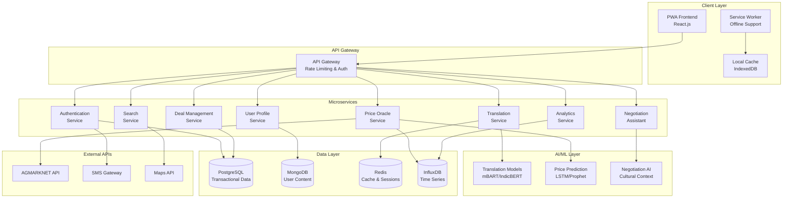

# Design Document: The Multilingual Mandi

## Overview

The Multilingual Mandi is a Progressive Web App (PWA) that creates an AI-powered marketplace for Indian agricultural commodities. The platform breaks language barriers through real-time translation, provides price transparency via AI-powered market intelligence, and facilitates fair negotiations between vendors and buyers across tier 2-3 cities and rural areas.

The system architecture follows a microservices pattern with offline-first design principles, supporting 22+ Indian languages and integrating with government agricultural data sources. The platform emphasizes mobile-first design, cultural sensitivity in negotiations, and robust performance on low-bandwidth networks.

## Architecture

### High-Level Architecture



### Technology Stack

**Frontend:**
- React.js 18+ with TypeScript for type safety
- PWA capabilities with Service Worker for offline support
- Material-UI with custom theming for Indian market aesthetics
- IndexedDB for local data storage and caching
- Web Speech API for voice interactions

**Backend:**
- Node.js with Express.js for API services
- Python with FastAPI for AI/ML services
- Docker containers for microservice deployment
- NGINX for load balancing and static content serving

**Databases:**
- PostgreSQL for transactional data (users, deals, transactions)
- MongoDB for flexible user-generated content (reviews, messages)
- Redis for session management and real-time caching
- InfluxDB for time-series price data and analytics

**AI/ML:**
- Fine-tuned mBART for multilingual translation
- IndicBERT for Indian language understanding
- LSTM/Prophet models for price prediction
- Custom negotiation models trained on Indian bargaining patterns

## Components and Interfaces

### Translation Service

**Purpose:** Provides real-time translation between 22+ Indian languages with mandi-specific vocabulary.

**Key Components:**
- `TranslationEngine`: Core translation logic using fine-tuned mBART models
- `VocabularyManager`: Manages mandi-specific terminology and context
- `LanguageDetector`: Automatically detects source language
- `QualityAssessor`: Evaluates translation confidence and flags low-quality translations

**Interfaces:**
```typescript
interface TranslationRequest {
  text: string;
  sourceLanguage?: string; // Auto-detect if not provided
  targetLanguage: string;
  context: 'general' | 'mandi' | 'negotiation';
}

interface TranslationResponse {
  translatedText: string;
  confidence: number; // 0-1 scale
  sourceLanguageDetected: string;
  requiresReview: boolean;
  alternativeTranslations?: string[];
}

interface VoiceTranslationRequest {
  audioData: Blob;
  sourceLanguage?: string;
  targetLanguage: string;
}
```

### Price Oracle Service

**Purpose:** Aggregates and analyzes price data from multiple sources to provide real-time market intelligence.

**Key Components:**
- `PriceAggregator`: Collects data from AGMARKNET and vendor submissions
- `PricePredictionEngine`: Uses LSTM/Prophet models for price forecasting
- `MarketAnalyzer`: Analyzes price trends and market conditions
- `PriceValidator`: Validates vendor-submitted prices against market data

**Interfaces:**
```typescript
interface PriceQuery {
  commodity: string;
  location?: string;
  radius?: number; // km
  dateRange?: {
    start: Date;
    end: Date;
  };
}

interface PriceData {
  commodity: string;
  price: number;
  unit: string;
  location: string;
  source: 'agmarknet' | 'vendor' | 'predicted';
  timestamp: Date;
  confidence: number;
  marketTrend: 'rising' | 'falling' | 'stable';
}

interface PriceRange {
  min: number;
  max: number;
  average: number;
  median: number;
  fairPriceRange: {
    lower: number;
    upper: number;
  };
}
```

### Negotiation Assistant Service

**Purpose:** Facilitates structured negotiations with cultural context awareness and real-time translation.

**Key Components:**
- `NegotiationEngine`: Manages negotiation flow and state
- `OfferGenerator`: Suggests opening offers based on market conditions
- `CulturalContextManager`: Applies Indian bargaining cultural norms
- `DealAnalyzer`: Evaluates deal fairness and market positioning

**Interfaces:**
```typescript
interface NegotiationSession {
  sessionId: string;
  vendorId: string;
  buyerId: string;
  commodity: string;
  quantity: number;
  currentOffer?: Offer;
  marketContext: MarketContext;
  status: 'active' | 'paused' | 'completed' | 'cancelled';
}

interface Offer {
  price: number;
  quantity: number;
  conditions: string[];
  validUntil: Date;
  counterOfferSuggestions?: number[];
}

interface MarketContext {
  currentMarketPrice: number;
  priceRange: PriceRange;
  seasonalTrend: string;
  demandLevel: 'low' | 'medium' | 'high';
}
```

### User Profile Service

**Purpose:** Manages user authentication, profiles, and reputation systems.

**Key Components:**
- `AuthenticationManager`: Handles OTP-based authentication
- `ProfileManager`: Manages user profiles and business verification
- `ReputationEngine`: Calculates and updates user reputation scores
- `VerificationService`: Handles business document verification

**Interfaces:**
```typescript
interface UserProfile {
  userId: string;
  phoneNumber: string;
  name: string;
  preferredLanguage: string;
  userType: 'vendor' | 'buyer' | 'both';
  businessInfo?: BusinessInfo;
  reputation: ReputationScore;
  isVerified: boolean;
  location: Location;
}

interface BusinessInfo {
  businessName: string;
  businessType: string;
  gstNumber?: string;
  verificationDocuments: string[];
  specializations: string[];
}

interface ReputationScore {
  overall: number; // 1-5 scale
  punctuality: number;
  communication: number;
  productQuality: number;
  totalTransactions: number;
  reviewCount: number;
}
```

### Deal Management Service

**Purpose:** Tracks deals, transactions, and manages the complete deal lifecycle.

**Key Components:**
- `DealTracker`: Manages deal states and transitions
- `TransactionManager`: Handles transaction records and payments
- `NotificationService`: Sends deal-related notifications
- `AuditLogger`: Maintains complete audit trails

**Interfaces:**
```typescript
interface Deal {
  dealId: string;
  vendorId: string;
  buyerId: string;
  commodity: string;
  quantity: number;
  agreedPrice: number;
  status: DealStatus;
  createdAt: Date;
  expectedDelivery?: Date;
  paymentTerms: PaymentTerms;
  auditTrail: AuditEntry[];
}

type DealStatus = 'negotiating' | 'agreed' | 'confirmed' | 'in_transit' | 'delivered' | 'completed' | 'disputed' | 'cancelled';

interface PaymentTerms {
  method: 'cash' | 'upi' | 'bank_transfer' | 'credit';
  dueDate: Date;
  advanceAmount?: number;
}
```

## Data Models

### Core Entities

**User Entity:**
```typescript
interface User {
  id: string;
  phoneNumber: string;
  name: string;
  email?: string;
  preferredLanguage: string;
  userType: 'vendor' | 'buyer' | 'both';
  location: {
    latitude: number;
    longitude: number;
    address: string;
    pincode: string;
    state: string;
  };
  businessProfile?: {
    businessName: string;
    businessType: string;
    gstNumber?: string;
    specializations: string[];
    operatingHours: string;
  };
  reputation: {
    overall: number;
    punctuality: number;
    communication: number;
    productQuality: number;
    totalTransactions: number;
    reviewCount: number;
  };
  isVerified: boolean;
  verificationDocuments: string[];
  createdAt: Date;
  lastActiveAt: Date;
}
```

**Commodity Entity:**
```typescript
interface Commodity {
  id: string;
  name: string;
  category: string;
  subcategory: string;
  standardUnit: string;
  alternativeUnits: string[];
  seasonality: {
    peakMonths: number[];
    offSeasonMonths: number[];
  };
  qualityGrades: string[];
  storageRequirements: string[];
  translations: {
    [languageCode: string]: {
      name: string;
      aliases: string[];
    };
  };
}
```

**Price Data Entity:**
```typescript
interface PriceEntry {
  id: string;
  commodityId: string;
  price: number;
  unit: string;
  location: {
    mandiName: string;
    district: string;
    state: string;
    coordinates: {
      latitude: number;
      longitude: number;
    };
  };
  source: 'agmarknet' | 'vendor_submission' | 'predicted';
  quality: string;
  timestamp: Date;
  confidence: number;
  validatedBy?: string;
  metadata: {
    weatherConditions?: string;
    marketConditions?: string;
    volume?: number;
  };
}
```

**Message Entity:**
```typescript
interface Message {
  id: string;
  conversationId: string;
  senderId: string;
  receiverId: string;
  originalText: string;
  originalLanguage: string;
  translatedText?: string;
  targetLanguage?: string;
  messageType: 'text' | 'voice' | 'image' | 'offer' | 'system';
  timestamp: Date;
  isRead: boolean;
  translationConfidence?: number;
  attachments?: {
    type: string;
    url: string;
    metadata: any;
  }[];
}
```

### Database Schema Design

**PostgreSQL Tables:**
- `users` - Core user information and authentication
- `deals` - Transaction records and deal management
- `conversations` - Chat conversation metadata
- `reviews` - User reviews and ratings
- `verification_requests` - Business verification tracking

**MongoDB Collections:**
- `messages` - Chat messages with translation data
- `user_preferences` - User settings and preferences
- `search_history` - User search patterns for analytics
- `notifications` - Push notification records

**InfluxDB Measurements:**
- `price_data` - Time-series price information
- `user_activity` - User interaction analytics
- `system_metrics` - Performance and usage metrics
- `translation_metrics` - Translation quality and usage stats

## Correctness Properties

*A property is a characteristic or behavior that should hold true across all valid executions of a system—essentially, a formal statement about what the system should do. Properties serve as the bridge between human-readable specifications and machine-verifiable correctness guarantees.*

Before defining the correctness properties, I need to analyze the acceptance criteria to determine which ones are testable as properties, examples, or edge cases.

### Property 1: Translation Performance and Accuracy
*For any* message sent between users speaking different languages, the Translation_Engine should translate the message to the target language within 2 seconds and achieve greater than 95% accuracy for mandi-specific vocabulary.
**Validates: Requirements 1.1, 1.2**

### Property 2: Translation Error Handling
*For any* translation with confidence below the threshold, the Translation_Engine should flag the message for manual review and provide alternative translations when available.
**Validates: Requirements 1.4**

### Property 3: Voice Translation Pipeline
*For any* voice input provided to the system, the Translation_Engine should convert speech to text and translate it to the target language while maintaining accuracy standards.
**Validates: Requirements 1.3**

### Property 4: Price Data Completeness
*For any* commodity search query, the Price_Oracle should return price data from at least 100 different mandis and display fair price ranges with confidence intervals.
**Validates: Requirements 2.1, 2.2**

### Property 5: Price Data Freshness
*For any* price data older than 24 hours, the Price_Oracle should clearly indicate the data age to users.
**Validates: Requirements 2.3**

### Property 6: Price Validation
*For any* vendor-submitted price update, the Price_Oracle should validate it against current market trends before acceptance.
**Validates: Requirements 2.5**

### Property 7: Negotiation Intelligence
*For any* negotiation session, the Negotiation_Assistant should provide market-based opening offers, real-time comparison data for counter-offers, and fair market range analysis for all proposed deals.
**Validates: Requirements 3.1, 3.2, 3.3**

### Property 8: Negotiation Translation Completeness
*For any* message in a negotiation session, the system should translate it in real-time between the parties' preferred languages.
**Validates: Requirements 3.4**

### Property 9: User Authentication and Verification
*For any* new user registration, the system should verify their mobile number through OTP and display verification badges upon completion of business verification.
**Validates: Requirements 4.1, 4.2**

### Property 10: Reputation System Consistency
*For any* completed transaction, the system should allow both parties to rate each other and update reputation scores based on transaction history and reviews.
**Validates: Requirements 4.3, 4.4, 8.5**

### Property 11: Profile Information Completeness
*For any* user profile, the system should display transaction history and payment punctuality scores.
**Validates: Requirements 4.5**

### Property 12: Offline Functionality
*For any* offline state, the PWA should allow browsing of cached data and synchronize all offline actions when connectivity is restored.
**Validates: Requirements 5.1, 5.2, 5.5**

### Property 13: Price Verification and Comparison
*For any* price quote entered by a user, the Price_Oracle should compare it against current market rates, alert for significant deviations, and show data from at least 5 comparable mandis.
**Validates: Requirements 6.1, 6.2, 6.3**

### Property 14: Historical Price Data
*For any* commodity, the system should provide historical price trends for the past 30 days and suggest negotiation strategies based on market position.
**Validates: Requirements 6.4, 6.5**

### Property 15: Search Performance and Results
*For any* search query, the system should return results within 3 seconds, support multiple Indian languages, and display vendor ratings, distance, and current prices in results.
**Validates: Requirements 7.1, 7.2, 7.3**

### Property 16: Search Filtering and Fallbacks
*For any* search with no exact matches, the system should suggest similar commodities or alternative vendors, and support filtering by location, price range, quantity, and vendor rating.
**Validates: Requirements 7.4, 7.5**

### Property 17: Deal Management and Audit
*For any* agreed deal, the system should create complete transaction records and maintain a full audit trail of all communications and status changes.
**Validates: Requirements 8.1, 8.4**

### Property 18: Notification System
*For any* deal status change or payment due date, the system should send notifications to both parties through push notifications.
**Validates: Requirements 8.2, 8.3**

### Property 19: Responsive Design
*For any* screen size from 320px to 1920px width, the PWA should display correctly and provide contextual assistance when users need help.
**Validates: Requirements 9.1, 9.4**

### Property 20: Accessibility Support
*For any* user interaction, the PWA should support both touch and voice interactions for accessibility.
**Validates: Requirements 9.5**

### Property 21: Analytics and Insights
*For any* vendor, the system should provide weekly performance summaries, compare performance against market averages, identify optimal pricing opportunities, and alert to seasonal demand patterns.
**Validates: Requirements 10.1, 10.2, 10.3, 10.4**

### Property 22: Market Change Notifications
*For any* significant market condition change, the system should notify relevant vendors with actionable recommendations.
**Validates: Requirements 10.5**

## Error Handling

### Translation Service Error Handling

**Low Confidence Translations:**
- When translation confidence falls below 80%, flag for manual review
- Provide alternative translation suggestions when available
- Allow users to request human translator assistance for critical negotiations

**Language Detection Failures:**
- Fallback to user's preferred language when auto-detection fails
- Prompt user to manually select source language
- Log detection failures for model improvement

**API Timeout Handling:**
- Implement 5-second timeout for translation requests
- Provide cached translations for common phrases during outages
- Queue failed translations for retry with exponential backoff

### Price Oracle Error Handling

**Data Source Failures:**
- Continue operation with available data sources when AGMARKNET is unavailable
- Clearly indicate when price data is incomplete or from limited sources
- Implement circuit breaker pattern for external API calls

**Price Validation Errors:**
- Reject vendor submissions that deviate more than 50% from market average
- Provide feedback to vendors about why submissions were rejected
- Allow appeals process for legitimate price variations

**Stale Data Handling:**
- Clearly mark data older than 24 hours with timestamps
- Provide confidence intervals that widen with data age
- Implement data freshness scoring system

### Offline Mode Error Handling

**Sync Conflicts:**
- Implement last-write-wins strategy for simple conflicts
- Prompt user resolution for complex conflicts (e.g., competing offers)
- Maintain conflict resolution audit trail

**Storage Limitations:**
- Implement LRU cache eviction when local storage is full
- Prioritize critical data (active deals, recent messages) for retention
- Provide user controls for cache management

**Network Recovery:**
- Implement progressive sync starting with highest priority data
- Provide sync status indicators to users
- Allow manual sync triggers for urgent updates

## Testing Strategy

### Dual Testing Approach

The testing strategy employs both unit testing and property-based testing to ensure comprehensive coverage:

**Unit Tests:**
- Focus on specific examples, edge cases, and error conditions
- Test integration points between microservices
- Validate specific business logic scenarios
- Test UI components and user interactions

**Property-Based Tests:**
- Verify universal properties across all inputs using randomized testing
- Test system behavior with generated data sets
- Validate correctness properties defined in this document
- Run minimum 100 iterations per property test

### Property-Based Testing Configuration

**Testing Framework:** 
- Frontend: fast-check for TypeScript/JavaScript property testing
- Backend: Hypothesis for Python services, fast-check for Node.js services

**Test Configuration:**
- Minimum 100 iterations per property test
- Custom generators for Indian language text, commodity data, and user profiles
- Shrinking enabled to find minimal failing examples
- Timeout of 30 seconds per property test

**Property Test Tagging:**
Each property-based test must include a comment referencing the design document property:
```typescript
// Feature: multilingual-mandi, Property 1: Translation Performance and Accuracy
```

### Testing Data Generation

**Language Data Generators:**
- Generate text in 22+ Indian languages with varying script complexity
- Include mandi-specific vocabulary and common phrases
- Generate voice data samples for speech-to-text testing

**Market Data Generators:**
- Generate realistic commodity prices with seasonal variations
- Create market condition scenarios (high/low demand, weather impacts)
- Generate historical price trends for backtesting

**User Behavior Generators:**
- Generate realistic user profiles across different demographics
- Create negotiation scenarios with cultural context
- Generate transaction patterns for reputation testing

### Integration Testing

**API Integration Tests:**
- Test AGMARKNET API integration with mock responses
- Validate SMS gateway integration for OTP delivery
- Test Maps API integration for location services

**Cross-Service Integration:**
- Test translation service integration with negotiation flows
- Validate price oracle integration with deal management
- Test user profile service integration with reputation system

**End-to-End Testing:**
- Complete user journey testing from registration to deal completion
- Multi-language negotiation scenarios
- Offline-to-online synchronization testing

### Performance Testing

**Load Testing:**
- Test system performance with 10,000+ concurrent users
- Validate translation service performance under high load
- Test database performance with large datasets

**Network Condition Testing:**
- Test PWA performance on 2G/3G networks
- Validate offline functionality across different devices
- Test sync performance with varying network conditions

**Mobile Device Testing:**
- Test across different Android and iOS devices
- Validate performance on low-end devices common in target markets
- Test battery usage and memory consumption