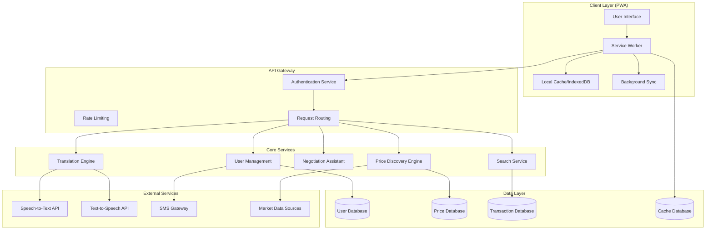

# Design Document: The Multilingual Mandi PWA

## Overview

The Multilingual Mandi is a progressive web application that modernizes India's traditional mandi ecosystem through AI-powered multilingual communication, real-time price discovery, and intelligent negotiation support. The system is designed as an offline-first PWA optimized for low-bandwidth environments, serving vendors, buyers, and commission agents across India's diverse linguistic landscape.

The architecture emphasizes cultural sensitivity, regional customization, and accessibility for users in tier 2-3 cities and rural areas. Core capabilities include real-time translation across 22+ Indian languages, AI-driven price analysis from multiple mandi sources, and culturally-aware negotiation assistance that preserves traditional bargaining customs.

## Architecture

### High-Level Architecture



### PWA Architecture Pattern

The application follows the **App Shell Architecture** pattern, optimized for offline-first functionality:

- **Application Shell**: Minimal HTML, CSS, and JavaScript required for the user interface, cached aggressively
- **Dynamic Content**: User data, prices, and messages loaded dynamically and cached strategically
- **Service Worker**: Handles caching strategies, background sync, and offline functionality
- **IndexedDB**: Local storage for user data, cached prices, and offline message queues

### Caching Strategy

**Cache-First Strategy** for static assets (app shell, UI components, translations)
**Network-First Strategy** for real-time data (current prices, live negotiations)
**Stale-While-Revalidate** for user profiles and historical data

## Components and Interfaces

### Translation Engine

**Purpose**: Handles multilingual communication with specialized mandi terminology support

**Key Components**:
- **Language Detection Service**: Automatically identifies input language
- **Translation Service**: Core translation functionality with context awareness
- **Terminology Dictionary**: Specialized vocabulary for agricultural and mandi terms
- **Speech Processing**: Integration with speech-to-text and text-to-speech services

**External Dependencies**:
- Primary: Bhashini AI for Indian language support
- Fallback: Google Translate API for additional language coverage
- Speech Services: Soniox API for Indian language speech recognition

**Interface**:
```typescript
interface TranslationEngine {
  translateText(text: string, fromLang: string, toLang: string): Promise<TranslationResult>
  detectLanguage(text: string): Promise<string>
  translateSpeech(audioBlob: Blob, fromLang: string, toLang: string): Promise<TranslationResult>
  getSpecializedTerms(domain: string): Promise<TerminologyMap>
}

interface TranslationResult {
  translatedText: string
  confidence: number
  originalText: string
  detectedLanguage?: string
  alternativeTranslations?: string[]
}
```

### Price Discovery Engine

**Purpose**: Aggregates and analyzes market data to provide real-time pricing intelligence

**Key Components**:
- **Data Aggregator**: Collects price data from multiple mandi sources
- **Price Analyzer**: AI-powered analysis for fair price calculation
- **Trend Calculator**: Historical analysis and price trend identification
- **Regional Adjuster**: Accounts for regional variations and quality grades

**Data Sources**:
- Government mandi price portals
- Agricultural market committees (APMCs)
- Commodity exchanges
- Partner mandi networks

**Interface**:
```typescript
interface PriceDiscoveryEngine {
  getCurrentPrice(commodity: string, location: string): Promise<PriceData>
  getPriceTrends(commodity: string, days: number): Promise<TrendData>
  calculateFairPriceRange(commodity: string, quality: string, location: string): Promise<PriceRange>
  getMarketAnalysis(commodity: string): Promise<MarketAnalysis>
}

interface PriceData {
  commodity: string
  currentPrice: number
  currency: string
  unit: string
  source: string
  timestamp: Date
  confidence: number
  qualityGrade?: string
}
```

### Negotiation Assistant

**Purpose**: Provides AI-powered negotiation guidance tailored to regional customs

**Key Components**:
- **Cultural Context Engine**: Understands regional bargaining norms
- **Price Strategy Calculator**: Suggests opening prices and counter-offers
- **Deal Analyzer**: Evaluates proposed deals against market benchmarks
- **Pattern Learning**: Improves recommendations based on user history

**Interface**:
```typescript
interface NegotiationAssistant {
  suggestOpeningPrice(commodity: string, marketPrice: number, userProfile: UserProfile): Promise<PriceStrategy>
  analyzeCounterOffer(offer: NegotiationOffer, context: NegotiationContext): Promise<OfferAnalysis>
  recommendResponse(currentOffer: number, targetPrice: number, negotiationHistory: NegotiationStep[]): Promise<ResponseStrategy>
  evaluateDeal(finalOffer: number, marketBenchmark: PriceRange): Promise<DealEvaluation>
}

interface PriceStrategy {
  suggestedPrice: number
  reasoning: string
  culturalNotes: string[]
  flexibilityRange: PriceRange
}
```

### User Management Service

**Purpose**: Handles authentication, profiles, and reputation management

**Key Components**:
- **Authentication Handler**: OTP-based mobile authentication
- **Profile Manager**: User profile creation and management
- **Reputation Calculator**: Trust score calculation based on transaction history
- **Verification Service**: User verification and badge management

**Interface**:
```typescript
interface UserManagementService {
  authenticateUser(phoneNumber: string, otp: string): Promise<AuthResult>
  createProfile(userData: UserRegistration): Promise<UserProfile>
  updateReputation(userId: string, transactionData: TransactionResult): Promise<ReputationUpdate>
  getPublicProfile(userId: string): Promise<PublicProfile>
}

interface UserProfile {
  id: string
  phoneNumber: string
  role: UserRole
  location: Location
  primaryLanguage: string
  commodityInterests: string[]
  reputationScore: number
  verificationBadges: string[]
  transactionHistory: TransactionSummary[]
}
```

### Search and Discovery Service

**Purpose**: Enables efficient discovery of commodities, vendors, and trading opportunities

**Key Components**:
- **Multilingual Search Engine**: Supports search in multiple Indian languages
- **Ranking Algorithm**: Relevance-based ranking with reputation weighting
- **Filter Engine**: Advanced filtering by location, price, quality, etc.
- **Recommendation Engine**: Suggests relevant trading opportunities

**Interface**:
```typescript
interface SearchService {
  searchCommodities(query: string, filters: SearchFilters, userLang: string): Promise<SearchResults>
  searchVendors(criteria: VendorCriteria, location: Location): Promise<VendorResults>
  getRecommendations(userProfile: UserProfile): Promise<Recommendation[]>
  autocompleteSearch(partialQuery: string, language: string): Promise<string[]>
}

interface SearchFilters {
  priceRange?: PriceRange
  locationRadius?: number
  qualityGrades?: string[]
  vendorTypes?: UserRole[]
  availability?: boolean
}
```

## Data Models

### Core Entities

**User Entity**:
```typescript
interface User {
  id: string
  phoneNumber: string
  role: 'vendor' | 'buyer' | 'commission_agent'
  profile: {
    name: string
    location: Location
    primaryLanguage: string
    secondaryLanguages: string[]
    commodityInterests: string[]
    businessType: string
    verificationStatus: VerificationStatus
  }
  reputation: {
    score: number
    totalTransactions: number
    successfulDeals: number
    averageRating: number
    badges: string[]
  }
  preferences: {
    units: MeasurementUnits
    currency: string
    notifications: NotificationSettings
    privacy: PrivacySettings
  }
  createdAt: Date
  lastActive: Date
}
```

**Commodity Entity**:
```typescript
interface Commodity {
  id: string
  name: string
  category: string
  subcategory: string
  standardUnits: string[]
  qualityGrades: QualityGrade[]
  seasonality: SeasonalPattern
  storageRequirements: StorageInfo
  translations: LanguageTranslations
  marketClassification: string
}
```

**Price Data Entity**:
```typescript
interface PriceRecord {
  id: string
  commodityId: string
  price: number
  unit: string
  currency: string
  qualityGrade: string
  location: Location
  source: DataSource
  timestamp: Date
  volume?: number
  confidence: number
  metadata: {
    weatherConditions?: string
    marketConditions?: string
    seasonalFactor?: number
  }
}
```

**Transaction Entity**:
```typescript
interface Transaction {
  id: string
  vendorId: string
  buyerId: string
  commodityId: string
  details: {
    quantity: number
    unit: string
    qualityGrade: string
    agreedPrice: number
    totalAmount: number
    deliveryTerms: DeliveryTerms
    paymentTerms: PaymentTerms
  }
  negotiationHistory: NegotiationStep[]
  status: TransactionStatus
  ratings: {
    vendorRating?: Rating
    buyerRating?: Rating
  }
  timestamps: {
    initiated: Date
    agreed: Date
    delivered?: Date
    completed?: Date
  }
}
```

**Message Entity**:
```typescript
interface Message {
  id: string
  conversationId: string
  senderId: string
  receiverId: string
  content: {
    originalText: string
    originalLanguage: string
    translatedText?: string
    targetLanguage?: string
    messageType: 'text' | 'voice' | 'negotiation_offer'
  }
  metadata: {
    translationConfidence?: number
    speechToTextConfidence?: number
    attachments?: Attachment[]
  }
  timestamp: Date
  status: MessageStatus
}
```

### Supporting Data Structures

**Location**:
```typescript
interface Location {
  state: string
  district: string
  mandis: string[]
  coordinates?: {
    latitude: number
    longitude: number
  }
  timezone: string
}
```

**Negotiation Context**:
```typescript
interface NegotiationContext {
  commodity: string
  quantity: number
  qualityGrade: string
  marketPrice: PriceRange
  regionalNorms: CulturalNorms
  userProfiles: {
    vendor: PublicProfile
    buyer: PublicProfile
  }
  negotiationHistory: NegotiationStep[]
}
```

## Correctness Properties

*A property is a characteristic or behavior that should hold true across all valid executions of a system—essentially, a formal statement about what the system should do. Properties serve as the bridge between human-readable specifications and machine-verifiable correctness guarantees.*

Before defining the correctness properties, I need to analyze the acceptance criteria from the requirements to determine which ones are testable as properties.

### Translation and Communication Properties

**Property 1: Multilingual translation completeness**
*For any* supported Indian language pair and any text message, the Translation_Engine should successfully translate the message and preserve the original text alongside the translation
**Validates: Requirements 1.1, 1.2, 1.5**

**Property 2: Specialized terminology handling**
*For any* message containing mandi-specific or agricultural terminology, the Translation_Engine should use the specialized dictionary to provide contextually accurate translations
**Validates: Requirements 1.3**

**Property 3: Speech-to-text translation pipeline**
*For any* voice input in a supported language, the system should successfully convert speech to text and then translate to the target language while maintaining accuracy
**Validates: Requirements 1.4**

### Price Discovery Properties

**Property 4: Price data aggregation**
*For any* commodity and region, the Price_Discovery_Engine should aggregate data from multiple mandi sources and provide comprehensive price information
**Validates: Requirements 2.1**

**Property 5: Price information completeness**
*For any* commodity search result, the system should display current prices, 7-day trends, fair price ranges, source mandi, timestamp, and confidence level
**Validates: Requirements 2.2, 2.4**

**Property 6: Regional price calculation**
*For any* commodity price calculation, the Price_Discovery_Engine should incorporate regional variations, seasonal factors, and quality grades into fair price range determination
**Validates: Requirements 2.5**

### Negotiation Assistant Properties

**Property 7: Market-based negotiation suggestions**
*For any* negotiation context, the Negotiation_Assistant should provide opening prices and counter-offers that fall within reasonable ranges based on current market data and regional norms
**Validates: Requirements 3.1, 3.2, 3.4**

**Property 8: Deal fairness analysis**
*For any* proposed deal, the system should analyze the offer against market benchmarks and provide consistent fairness assessments
**Validates: Requirements 3.3**

**Property 9: Negotiation history persistence**
*For any* user negotiation, the system should store the negotiation history and use it to improve future recommendations
**Validates: Requirements 3.5**

### User Management Properties

**Property 10: Authentication and profile creation**
*For any* valid mobile number and OTP combination, the system should successfully create a user account and allow complete profile setup with all required fields
**Validates: Requirements 4.1, 4.2**

**Property 11: Reputation calculation consistency**
*For any* user with transaction history, the Reputation_System should calculate trust scores consistently based on completed transactions, ratings, and profile completeness
**Validates: Requirements 4.4**

**Property 12: Profile data integrity**
*For any* user profile, the system should maintain transaction history, ratings, and verification status accurately over time and display appropriate reputation information during interactions
**Validates: Requirements 4.3, 4.5**

### Offline Functionality Properties

**Property 13: Offline data caching**
*For any* essential data type (prices, profiles, conversations), the PWA should cache the data and make it accessible when offline
**Validates: Requirements 5.1**

**Property 14: Offline operation capability**
*For any* core functionality (message composition, cached price viewing, transaction preparation), the system should work correctly when network connectivity is unavailable
**Validates: Requirements 5.2**

**Property 15: Offline synchronization**
*For any* action performed while offline, the system should queue the action and successfully synchronize it when connectivity is restored
**Validates: Requirements 5.3**

**Property 16: SMS fallback activation**
*For any* critical communication when network is unavailable, the system should automatically trigger SMS fallback mechanisms
**Validates: Requirements 5.4**

### Search and Discovery Properties

**Property 17: Multilingual search functionality**
*For any* search query in a supported language, the system should return relevant results for commodities, vendors, and locations
**Validates: Requirements 6.1**

**Property 18: Search result ranking and completeness**
*For any* search query, results should be ranked by relevance, proximity, reputation, and availability, and display all required information including prices, ratings, and distance
**Validates: Requirements 6.2, 6.5**

**Property 19: Search filtering accuracy**
*For any* combination of search filters (price range, location, quality grade, vendor type), the system should return only results that match all specified criteria
**Validates: Requirements 6.3**

**Property 20: Commodity categorization compliance**
*For any* commodity in the system, it should be properly categorized according to standard agricultural classification systems
**Validates: Requirements 6.4**

### Transaction Management Properties

**Property 21: Transaction record completeness**
*For any* agreed deal, the system should create a transaction record containing all required details (commodity, quantity, price, delivery terms) and support status tracking through all stages
**Validates: Requirements 7.1, 7.2**

**Property 22: Transaction rating and analytics**
*For any* completed transaction, users should be able to submit ratings and reviews, and the system should generate accurate transaction summaries and analytics
**Validates: Requirements 7.3, 7.4**

**Property 23: Dispute resolution workflow**
*For any* transaction dispute, the system should provide a structured resolution process with appropriate Commission_Agent mediation steps
**Validates: Requirements 7.5**

### Regional Customization Properties

**Property 24: Regional adaptation**
*For any* user location, the system should adapt UI elements, terminology, workflows, market practices, measurement units, and price display formats to match regional preferences
**Validates: Requirements 8.1, 8.2, 8.3**

**Property 25: Regional temporal awareness**
*For any* recommendation or system behavior, the system should account for regional holidays, market days, and seasonal patterns
**Validates: Requirements 8.4**

**Property 26: Regional payment method support**
*For any* region, the system should provide appropriate local payment methods and support regional transaction customs
**Validates: Requirements 8.5**

### Security and Privacy Properties

**Property 27: Data encryption and access control**
*For any* user communication or sensitive data, the system should encrypt the data in transit and at rest, and enforce role-based access controls
**Validates: Requirements 9.1, 9.2**

**Property 28: Privacy compliance and user control**
*For any* data collection, the system should obtain explicit user consent and provide users with complete control over their personal data (view, modify, delete)
**Validates: Requirements 9.3, 9.4**

**Property 29: Authentication security**
*For any* authentication attempt, the system should implement secure authentication mechanisms and proper session management to prevent unauthorized access
**Validates: Requirements 9.5**

### Performance Properties

**Property 30: Caching efficiency**
*For any* repeated data request, the system should implement efficient caching strategies that minimize redundant data transfer and improve response times
**Validates: Requirements 10.3**

## Error Handling

### Translation Engine Error Handling

**Language Detection Failures**: When language detection fails, the system falls back to user's primary language setting and prompts for manual language selection.

**Translation Service Outages**: Primary translation service (Bhashini AI) failures trigger automatic fallback to Google Translate API. If both services are unavailable, the system queues translation requests for later processing and notifies users of the delay.

**Speech Recognition Errors**: Poor audio quality or unsupported dialects trigger re-recording prompts with audio quality tips. The system provides text input alternatives when speech recognition consistently fails.

**Terminology Dictionary Misses**: Unknown mandi terms are flagged for manual review and temporarily translated using general dictionaries while maintaining a learning queue for specialized term additions.

### Price Discovery Error Handling

**Data Source Failures**: When individual mandi data sources become unavailable, the system continues operating with remaining sources and clearly indicates reduced data coverage. Price confidence scores are adjusted accordingly.

**Stale Data Detection**: Price data older than 30 minutes during market hours is flagged as potentially stale. Users receive warnings about data freshness, and the system attempts to refresh from alternative sources.

**Price Calculation Errors**: Invalid or extreme price data points are automatically filtered using statistical outlier detection. The system logs anomalies for manual review while providing price ranges based on validated data.

**Regional Data Gaps**: Missing regional price data triggers expansion of search radius and clear indication of data source locations. Users are informed when prices are from distant markets.

### Offline Mode Error Handling

**Cache Corruption**: Corrupted local cache data is automatically detected and cleared, triggering fresh data download when connectivity returns. Users receive notification of cache refresh.

**Storage Quota Exceeded**: When local storage limits are reached, the system implements intelligent cache eviction, prioritizing recent and frequently accessed data while archiving older information.

**Sync Conflicts**: When offline actions conflict with server state, the system presents conflict resolution options to users, allowing them to choose between local and server versions or merge changes.

**SMS Fallback Failures**: SMS gateway failures trigger alternative communication channels (email if available) or queue messages for retry with exponential backoff.

### Authentication and Security Error Handling

**OTP Delivery Failures**: Failed OTP delivery triggers automatic retry with alternative SMS providers. After multiple failures, the system offers voice call OTP delivery or manual verification options.

**Session Expiry**: Expired sessions are handled gracefully with automatic re-authentication prompts that preserve user context and unsaved work.

**Rate Limiting**: Excessive API requests trigger progressive rate limiting with clear user feedback about temporary restrictions and retry timing.

**Data Breach Detection**: Suspicious access patterns trigger automatic security measures including session termination, password reset requirements, and user notification.

## Testing Strategy

### Dual Testing Approach

The Multilingual Mandi requires comprehensive testing through both unit tests and property-based tests to ensure correctness across the diverse range of inputs and cultural contexts.

**Unit Tests** focus on:
- Specific examples of translation accuracy for known language pairs
- Edge cases in price calculation algorithms
- Integration points between PWA components and external services
- Error conditions and fallback mechanisms
- Regional customization examples for specific locations

**Property-Based Tests** focus on:
- Universal properties that hold across all supported languages and regions
- Comprehensive input coverage through randomized test data generation
- Correctness properties that validate system behavior across all valid inputs
- Cultural and regional adaptation consistency

### Property-Based Testing Configuration

**Testing Framework**: Fast-check for JavaScript/TypeScript property-based testing
**Test Iterations**: Minimum 100 iterations per property test to ensure comprehensive coverage
**Test Data Generation**: Custom generators for Indian languages, mandi terminology, regional data, and cultural contexts

Each property-based test will be tagged with comments referencing the design document property:
**Feature: multilingual-mandi, Property {number}: {property_text}**

### Testing Categories

**Translation Testing**:
- Property tests for translation accuracy across all language pairs
- Unit tests for specific mandi terminology translations
- Performance tests for translation speed requirements
- Integration tests with external translation APIs

**Price Discovery Testing**:
- Property tests for price aggregation and calculation logic
- Unit tests for specific market scenarios and edge cases
- Integration tests with mandi data sources
- Performance tests for real-time data processing

**Offline Functionality Testing**:
- Property tests for cache consistency and synchronization
- Unit tests for specific offline scenarios
- Integration tests for PWA service worker behavior
- Network simulation tests for various connectivity conditions

**Cultural Adaptation Testing**:
- Property tests for regional customization consistency
- Unit tests for specific cultural norm implementations
- Localization tests for UI elements and terminology
- User acceptance tests for cultural appropriateness

**Security Testing**:
- Property tests for encryption and access control
- Unit tests for authentication flows
- Penetration testing for security vulnerabilities
- Compliance testing for data protection regulations

### Test Environment Setup

**Multi-language Test Data**: Comprehensive test datasets in all 22+ supported Indian languages
**Regional Test Scenarios**: Test data covering different Indian states and regional practices
**Market Data Simulation**: Mock mandi data sources for consistent testing
**Network Condition Simulation**: Tools for testing various connectivity scenarios
**Cultural Context Simulation**: Test scenarios for different regional bargaining customs

The testing strategy ensures that the Multilingual Mandi works correctly across India's diverse linguistic, cultural, and technological landscape while maintaining high performance and security standards.